# Graphical Test Overview

This README visualizes a subset of the graphical tests and serves as an artifact for discussion around 
1) the conformance of guc and the MaterialX glTF PBR implementation
2) UsdPreviewSurface limitations and shading differences
3) existing problems in guc and involved technologies.

> Note: please see [run_tests.sh](../run_tests.sh) for additional notes and deactivated tests.

### glTF-Asset-Generator (<a href="https://github.com/KhronosGroup/glTF-Asset-Generator/tree/a2b0117b41a66d17f2a1860c81da498da65b6054/Output/Positive">source</a>)

<table>
  <tr>
    <th>Index</th>
    <th>USD+UsdPreviewSurface</th>
    <th>USD+MaterialX</th>
    <th>glTF&nbsp;Ref.</th>
  </tr>

  <tr align="middle">
    <td colspan="4">Accessor_Sparse</td>
  </tr>
  <tr align="middle">
    <td>02</td>
    <td></td>
    <td></td>
    <td></td>
  </tr>
  <tr align="middle">
    <td>03</td>
    <td></td>
    <td></td>
    <td></td>
  </tr>

  <tr align="middle">
    <td colspan="4">Accessor_SparseType</td>
  </tr>
  <tr align="middle">
    <td>05</td>
    <td></td>
    <td></td>
    <td></td>
  </tr>

  <tr align="middle">
    <td colspan="4">Buffer_Interleaved</td>
  </tr>
  <tr align="middle">
    <td>00</td>
    <td></td>
    <td></td>
    <td></td>
  </tr align="middle">
  <tr align="middle">
    <td>01</td>
    <td></td>
    <td></td>
    <td></td>
  </tr>
  <tr align="middle">
    <td>02</td>
    <td></td>
    <td></td>
    <td></td>
  </tr>
  <tr align="middle">
    <td>03</td>
    <td></td>
    <td></td>
    <td></td>
  </tr>
  <tr align="middle">
    <td>04</td>
    <td></td>
    <td></td>
    <td></td>
  </tr>

  <tr align="middle">
    <td colspan="4">Instancing</td>
  </tr>
  <tr align="middle">
    <td>00</td>
    <td>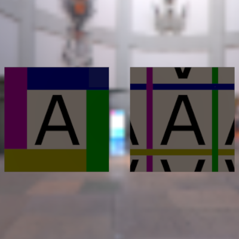</td>
    <td>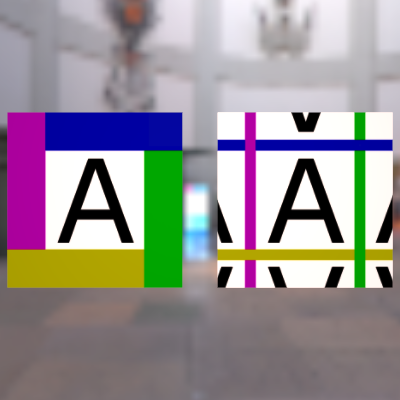</td>
    <td></td>
  </tr>
  <tr align="middle">
    <td>01</td>
    <td>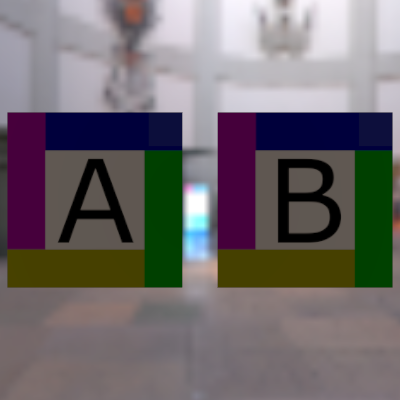</td>
    <td></td>
    <td></td>
  </tr>
  <tr align="middle">
    <td>02</td>
    <td>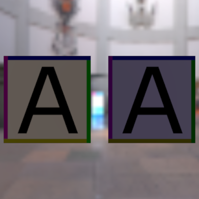</td>
    <td></td>
    <td></td>
  </tr>
  <tr align="middle">
    <td>03</td>
    <td></td>
    <td>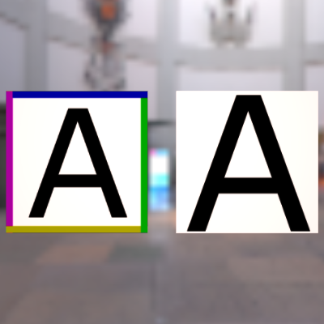</td>
    <td></td>
  </tr>
  <tr align="middle">
    <td>04</td>
    <td></td>
    <td>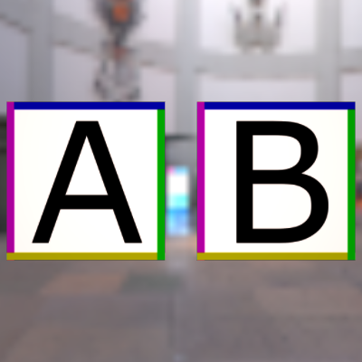</td>
    <td></td>
  </tr>
  <tr align="middle">
    <td>05</td>
    <td></td>
    <td></td>
    <td></td>
  </tr>
  <tr align="middle">
    <td>06</td>
    <td>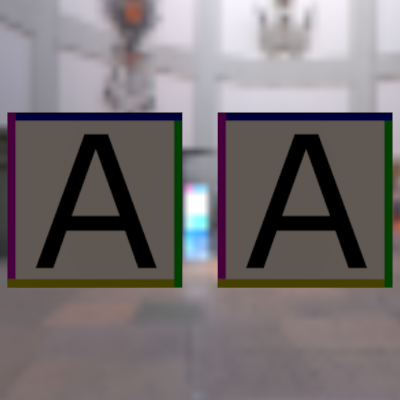</td>
    <td>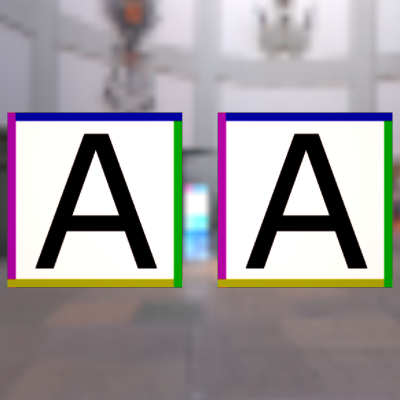</td>
    <td></td>
  </tr>
  <tr align="middle">
    <td>07</td>
    <td></td>
    <td>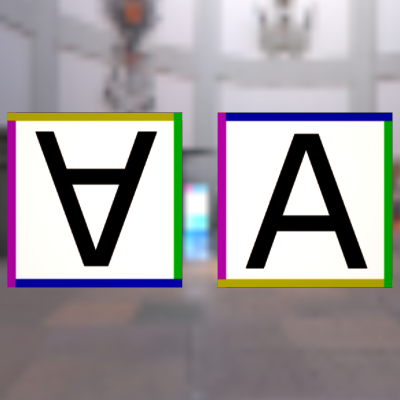</td>
    <td></td>
  </tr>

  <tr align="middle">
    <td colspan="4">Material</td>
  </tr>
  <tr align="middle">
    <td>00</td>
    <td>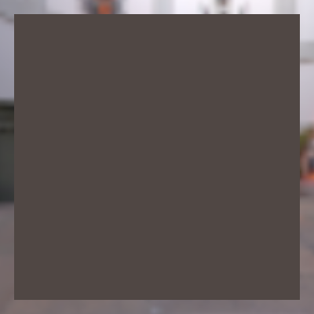</td>
    <td></td>
    <td></td>
  </tr>
  <tr align="middle">
    <td>01</td>
    <td>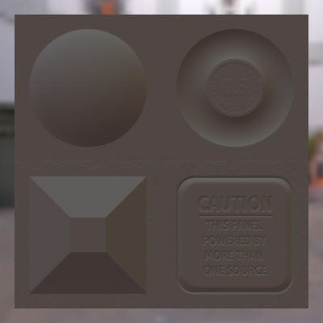</td>
    <td></td>
    <td></td>
  </tr>
  <tr align="middle">
    <td>02</td>
    <td>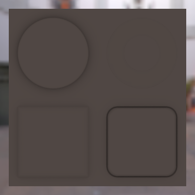</td>
    <td></td>
    <td></td>
  </tr>
  <tr align="middle">
    <td>03</td>
    <td></td>
    <td></td>
    <td></td>
  </tr>
  <tr align="middle">
    <td>04</td>
    <td></td>
    <td></td>
    <td></td>
  </tr>
  <tr align="middle">
    <td>05</td>
    <td>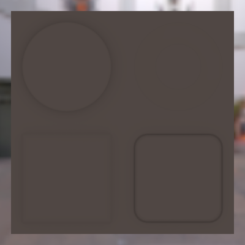</td>
    <td></td>
    <td></td>
  </tr>
  <tr align="middle">
    <td>06</td>
    <td></td>
    <td>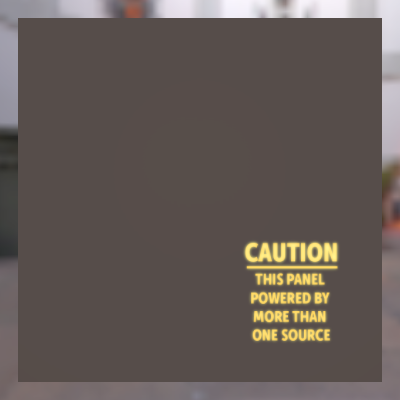</td>
    <td></td>
  </tr>
  <tr align="middle">
    <td>07</td>
    <td>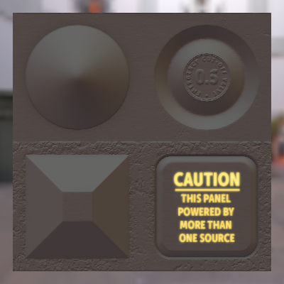</td>
    <td></td>
    <td></td>
  </tr>

  <tr align="middle">
    <td colspan="4">Material_AlphaBlend</td>
  </tr>
  <tr align="middle">
    <td>00</td>
    <td></td>
    <td></td>
    <td></td>
  </tr>
  <tr align="middle">
    <td>01</td>
    <td>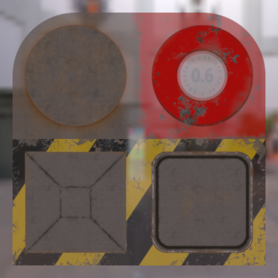</td>
    <td></td>
    <td></td>
  </tr>
  <tr align="middle">
    <td>02</td>
    <td></td>
    <td></td>
    <td></td>
  </tr>
  <tr align="middle">
    <td>03</td>
    <td></td>
    <td>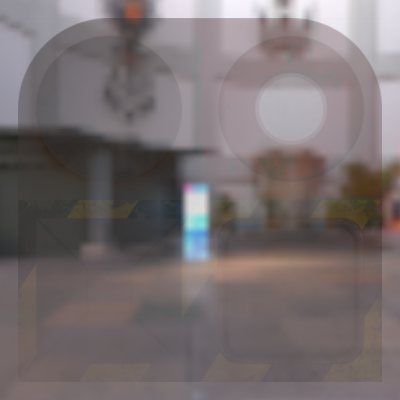</td>
    <td></td>
  </tr>
  <tr align="middle">
    <td>04</td>
    <td></td>
    <td></td>
    <td></td>
  </tr>
  <tr align="middle">
    <td>05</td>
    <td></td>
    <td></td>
    <td></td>
  </tr>
  <tr align="middle">
    <td>06</td>
    <td></td>
    <td></td>
    <td></td>
  </tr>

  <tr align="middle">
    <td colspan="4">Material_AlphaMask</td>
  </tr>
  <tr align="middle">
    <td>00</td>
    <td></td>
    <td></td>
    <td></td>
  </tr>
  <tr align="middle">
    <td>01</td>
    <td></td>
    <td></td>
    <td></td>
  </tr>
  <tr align="middle">
    <td>02</td>
    <td>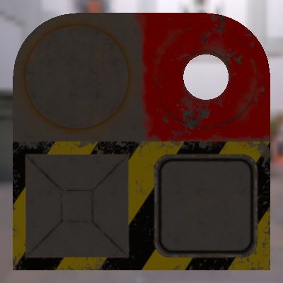</td>
    <td>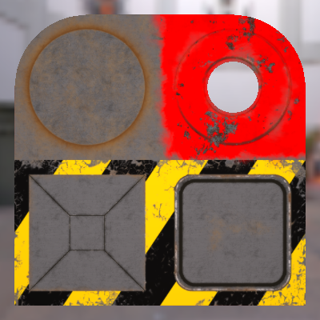</td>
    <td></td>
  </tr>
  <tr align="middle">
    <td>03</td>
    <td></td>
    <td></td>
    <td></td>
  </tr>
  <tr align="middle">
    <td>04</td>
    <td>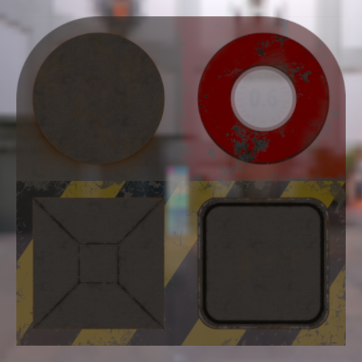</td>
    <td></td>
    <td></td>
  </tr>
  <tr align="middle">
    <td>05</td>
    <td>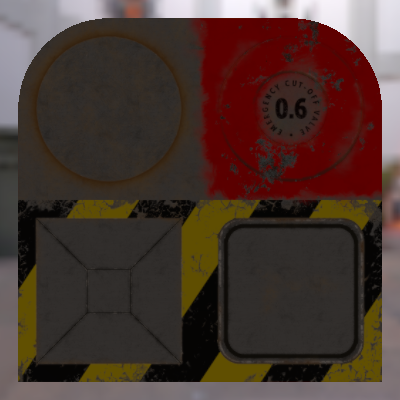</td>
    <td></td>
    <td></td>
  </tr>
  <tr align="middle">
    <td>06</td>
    <td></td>
    <td>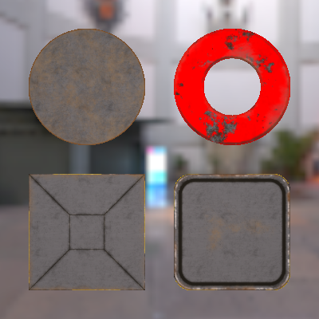</td>
    <td></td>
  </tr>

  <tr align="middle">
    <td colspan="4">Material_DoubleSided</td>
  </tr>
  <tr align="middle">
    <td>00</td>
    <td></td>
    <td></td>
    <td></td>
  </tr>
  <tr align="middle">
    <td>01</td>
    <td></td>
    <td></td>
    <td></td>
  </tr>
  <tr align="middle">
    <td>02</td>
    <td></td>
    <td></td>
    <td></td>
  </tr>
  <tr align="middle">
    <td>03</td>
    <td></td>
    <td></td>
    <td></td>
  </tr>
  <tr align="middle">
    <td>04</td>
    <td></td>
    <td></td>
    <td></td>
  </tr>

  <tr align="middle">
    <td colspan="4">Material_MetallicRoughness</td>
  </tr>
  <tr align="middle">
    <td>00</td>
    <td></td>
    <td></td>
    <td></td>
  </tr>
  <tr align="middle">
    <td>01</td>
    <td></td>
    <td>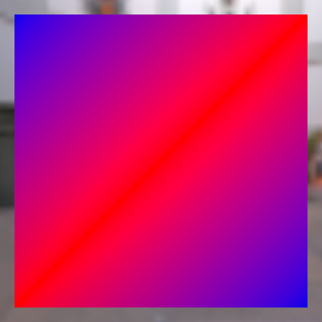</td>
    <td></td>
  </tr>
  <tr align="middle">
    <td>02</td>
    <td></td>
    <td></td>
    <td></td>
  </tr>
  <tr align="middle">
    <td>03</td>
    <td></td>
    <td></td>
    <td></td>
  </tr>
  <tr align="middle">
    <td>04</td>
    <td></td>
    <td>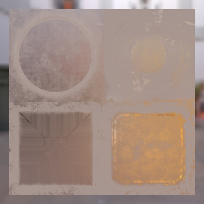</td>
    <td></td>
  </tr>
  <tr align="middle">
    <td>05</td>
    <td></td>
    <td></td>
    <td></td>
  </tr>
  <tr align="middle">
    <td>06</td>
    <td></td>
    <td></td>
    <td></td>
  </tr>
  <tr align="middle">
    <td>07</td>
    <td></td>
    <td></td>
    <td></td>
  </tr>
  <tr align="middle">
    <td>08</td>
    <td></td>
    <td>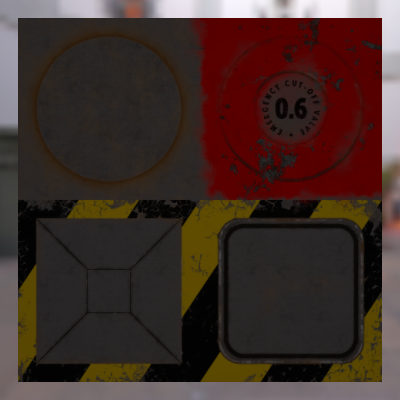</td>
    <td></td>
  </tr>
  <tr align="middle">
    <td>09</td>
    <td>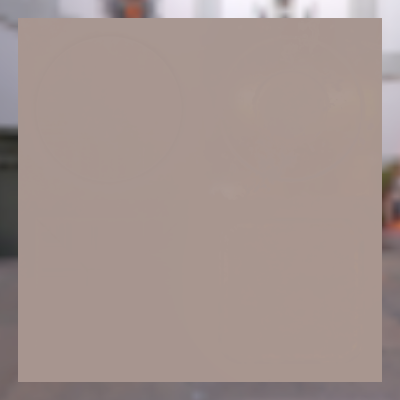</td>
    <td>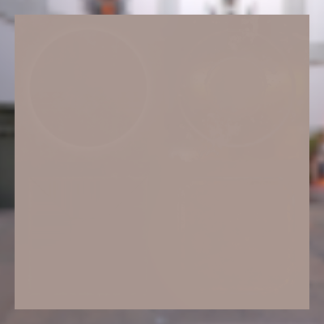</td>
    <td></td>
  </tr>
  <tr align="middle">
    <td>10</td>
    <td>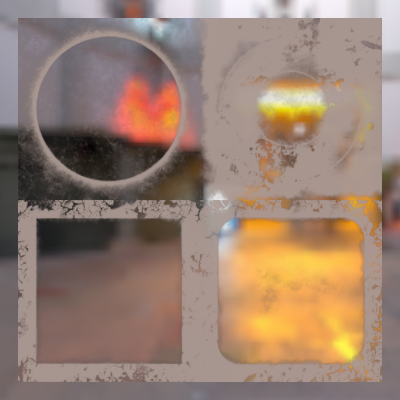</td>
    <td></td>
    <td></td>
  </tr>
  <tr align="middle">
    <td>11</td>
    <td></td>
    <td>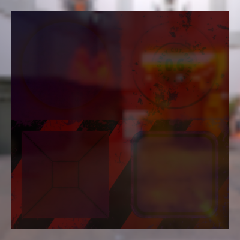</td>
    <td></td>
  </tr>

  <tr align="middle">
    <td colspan="4">Mesh_PrimitiveAttribute</td>
  </tr>
  <tr align="middle">
    <td>00</td>
    <td></td>
    <td></td>
    <td></td>
  </tr>
  <tr align="middle">
    <td>01</td>
    <td></td>
    <td></td>
    <td></td>
  </tr>
  <tr align="middle">
    <td>02</td>
    <td></td>
    <td></td>
    <td></td>
  </tr>
  <tr align="middle">
    <td>03</td>
    <td></td>
    <td></td>
    <td></td>
  </tr>
  <tr align="middle">
    <td>04</td>
    <td></td>
    <td></td>
    <td></td>
  </tr>
  <tr align="middle">
    <td>05</td>
    <td>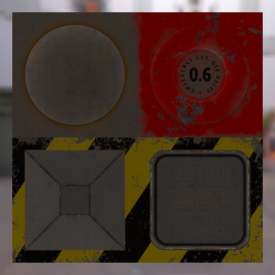</td>
    <td></td>
    <td></td>
  </tr>
  <tr align="middle">
    <td>06</td>
    <td></td>
    <td></td>
    <td></td>
  </tr>

  <tr align="middle">
    <td colspan="4">Mesh_PrimitiveMode</td>
  </tr>
  <tr align="middle">
    <td>04</td>
    <td></td>
    <td></td>
    <td></td>
  </tr>
  <tr align="middle">
    <td>05</td>
    <td></td>
    <td></td>
    <td></td>
  </tr>
  <tr align="middle">
    <td>06</td>
    <td></td>
    <td></td>
    <td></td>
  </tr>
  <tr align="middle">
    <td>11</td>
    <td></td>
    <td></td>
    <td></td>
  </tr>
  <tr align="middle">
    <td>12</td>
    <td></td>
    <td></td>
    <td></td>
  </tr>
  <tr align="middle">
    <td>13</td>
    <td></td>
    <td></td>
    <td></td>
  </tr>
  <tr align="middle">
    <td>14</td>
    <td></td>
    <td></td>
    <td></td>
  </tr>
  <tr align="middle">
    <td>15</td>
    <td></td>
    <td></td>
    <td></td>
  </tr>

  <tr align="middle">
    <td colspan="4">Mesh_PrimitiveVertexColor</td>
  </tr>
  <tr align="middle">
    <td>00</td>
    <td></td>
    <td></td>
    <td></td>
  </tr>
  <tr align="middle">
    <td>01</td>
    <td></td>
    <td></td>
    <td></td>
  </tr>
  <tr align="middle">
    <td>02</td>
    <td></td>
    <td></td>
    <td></td>
  </tr>
  <tr align="middle">
    <td>03</td>
    <td></td>
    <td></td>
    <td></td>
  </tr>
  <tr align="middle">
    <td>04</td>
    <td></td>
    <td></td>
    <td></td>
  </tr>
  <tr align="middle">
    <td>05</td>
    <td></td>
    <td></td>
    <td></td>
  </tr>

  <tr align="middle">
    <td colspan="4">Mesh_Primitives</td>
  </tr>
  <tr align="middle">
    <td>00</td>
    <td></td>
    <td></td>
    <td></td>
  </tr>

  <tr align="middle">
    <td colspan="4">Mesh_PrimitivesUV</td>
  </tr>
  <tr align="middle">
    <td>00</td>
    <td>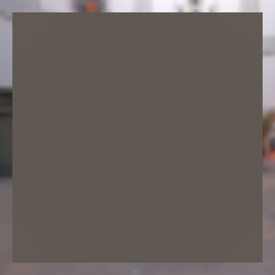</td>
    <td></td>
    <td></td>
  </tr>
  <tr align="middle">
  <td>01</td>
    <td></td>
    <td>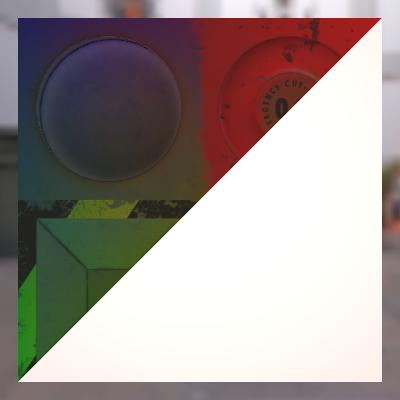</td>
    <td></td>
  </tr>
  <tr align="middle">
    <td>02</td>
    <td></td>
    <td>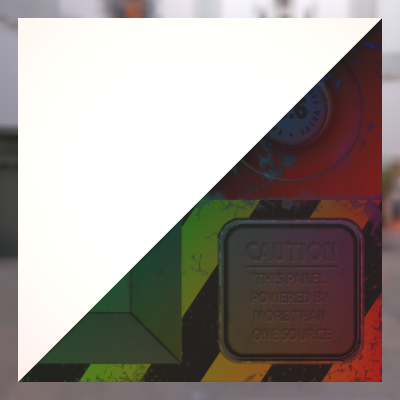</td>
    <td></td>
  </tr>
  <tr align="middle">
    <td>03</td>
    <td></td>
    <td>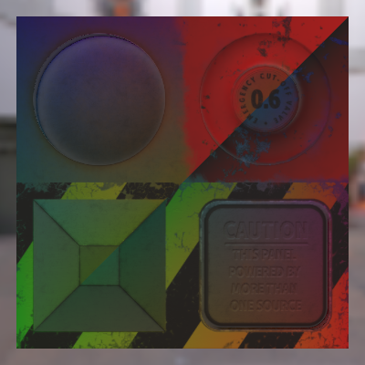</td>
    <td></td>
  </tr>
  <tr align="middle">
    <td>04</td>
    <td></td>
    <td>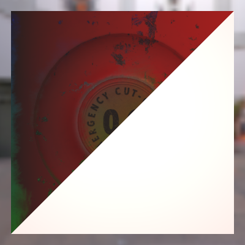</td>
    <td></td>
  </tr>
  <tr align="middle">
    <td>05</td>
    <td></td>
    <td>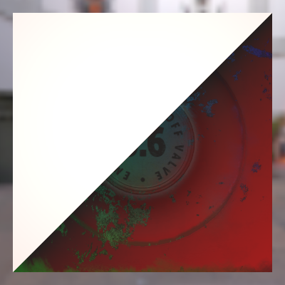</td>
    <td></td>
  </tr>
  <tr align="middle">
    <td>06</td>
    <td></td>
    <td>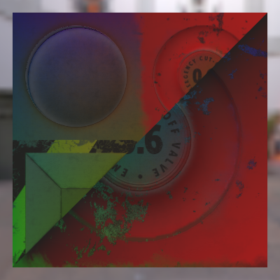</td>
    <td></td>
  </tr>
  <tr align="middle">
    <td>07</td>
    <td></td>
    <td>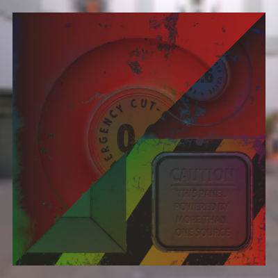</td>
    <td></td>
  </tr>
  <tr align="middle">
    <td>08</td>
    <td></td>
    <td></td>
    <td></td>
  </tr>

  <tr align="middle">
    <td colspan="4">Node_Attribute</td>
  </tr>
  <tr align="middle">
    <td>00</td>
    <td></td>
    <td>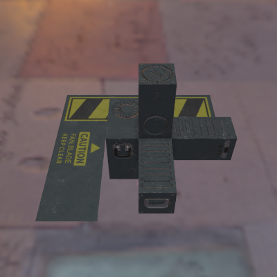</td>
    <td></td>
  </tr>
  <tr align="middle">
    <td>01</td>
    <td></td>
    <td></td>
    <td></td>
  </tr>
  <tr align="middle">
    <td>02</td>
    <td></td>
    <td></td>
    <td></td>
  </tr>
  <tr align="middle">
    <td>03</td>
    <td></td>
    <td></td>
    <td></td>
  </tr>
  <tr align="middle">
    <td>04</td>
    <td>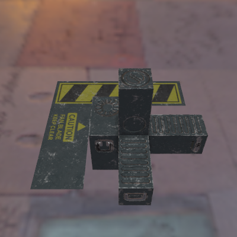</td>
    <td>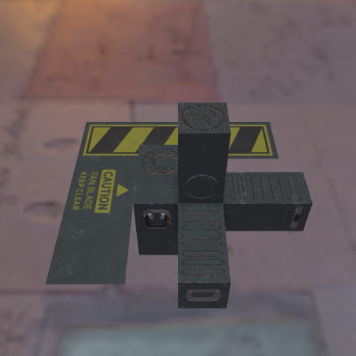</td>
    <td></td>
  </tr>
  <tr align="middle">
    <td>05</td>
    <td></td>
    <td></td>
    <td></td>
  </tr>
  <tr align="middle">
    <td>06</td>
    <td></td>
    <td>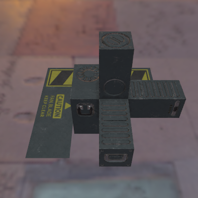</td>
    <td></td>
  </tr>
  <tr align="middle">
    <td>07</td>
    <td>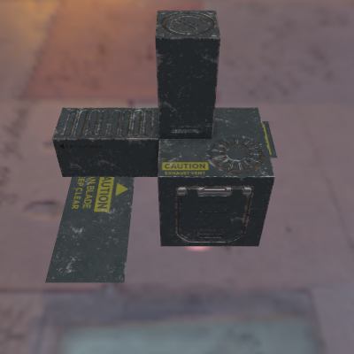</td>
    <td></td>
    <td></td>
  </tr>
  <tr align="middle">
    <td>08</td>
    <td></td>
    <td></td>
    <td></td>
  </tr>

  <tr align="middle">
    <td colspan="4">Node_NegativeScale</td>
  </tr>
  <tr align="middle">
    <td>00</td>
    <td></td>
    <td></td>
    <td></td>
  </tr>
  <tr align="middle">
    <td>01</td>
    <td></td>
    <td></td>
    <td></td>
  </tr>
  <tr align="middle">
    <td>02</td>
    <td></td>
    <td></td>
    <td></td>
  </tr>
  <tr align="middle">
    <td>03</td>
    <td></td>
    <td></td>
    <td></td>
  </tr>
  <tr align="middle">
    <td>04</td>
    <td></td>
    <td></td>
    <td></td>
  </tr>
  <tr align="middle">
    <td>05</td>
    <td></td>
    <td></td>
    <td></td>
  </tr>
  <tr align="middle">
    <td>06</td>
    <td></td>
    <td></td>
    <td></td>
  </tr>
  <tr align="middle">
    <td>07</td>
    <td></td>
    <td></td>
    <td></td>
  </tr>
  <tr align="middle">
    <td>08</td>
    <td></td>
    <td></td>
    <td></td>
  </tr>
  <tr align="middle">
    <td>09</td>
    <td></td>
    <td></td>
    <td></td>
  </tr>
  <tr align="middle">
    <td>10</td>
    <td></td>
    <td></td>
    <td></td>
  </tr>
  <tr align="middle">
    <td>11</td>
    <td></td>
    <td></td>
    <td></td>
  </tr>
  <tr align="middle">
    <td>12</td>
    <td></td>
    <td></td>
    <td></td>
  </tr>

  <tr align="middle">
    <td colspan="4">Texture_Sampler</td>
  </tr>
  <tr align="middle">
    <td>00</td>
    <td></td>
    <td></td>
    <td></td>
  </tr>
  <tr align="middle">
    <td>01</td>
    <td></td>
    <td>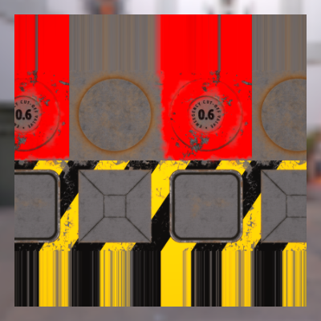</td>
    <td></td>
  </tr>
  <tr align="middle">
    <td>02</td>
    <td></td>
    <td>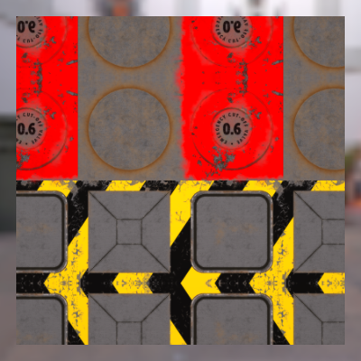</td>
    <td></td>
  </tr>
  <tr align="middle">
    <td>03</td>
    <td></td>
    <td>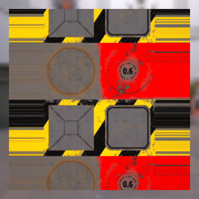</td>
    <td></td>
  </tr>
  <tr align="middle">
    <td>04</td>
    <td></td>
    <td></td>
    <td></td>
  </tr>
  <tr align="middle">
    <td>05</td>
    <td></td>
    <td></td>
    <td></td>
  </tr>
  <tr align="middle">
    <td>06</td>
    <td></td>
    <td></td>
    <td></td>
  </tr>
  <tr align="middle">
    <td>07</td>
    <td></td>
    <td></td>
    <td></td>
  </tr>
  <tr align="middle">
    <td>08</td>
    <td></td>
    <td></td>
    <td></td>
  </tr>
  <tr align="middle">
    <td>09</td>
    <td></td>
    <td></td>
    <td></td>
  </tr>
  <tr align="middle">
    <td>10</td>
    <td></td>
    <td></td>
    <td></td>
  </tr>
  <tr align="middle">
    <td>11</td>
    <td></td>
    <td></td>
    <td></td>
  </tr>
  <tr align="middle">
    <td>12</td>
    <td></td>
    <td></td>
    <td></td>
  </tr>
  <tr align="middle">
    <td>13</td>
    <td></td>
    <td>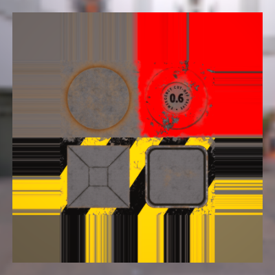</td>
    <td></td>
  </tr>
</table>

### glTF-Sample-Models (<a href="https://github.com/KhronosGroup/glTF-Sample-Models/tree/master/2.0">source</a>)

Complex Models

<table>
  <tr>
    <th>Name</th>
    <th>USD+UsdPreviewSurface</th>
    <th>USD+MaterialX</th>
  </tr>
  <tr>
    <td>2CylinderEngine</td>
    <td>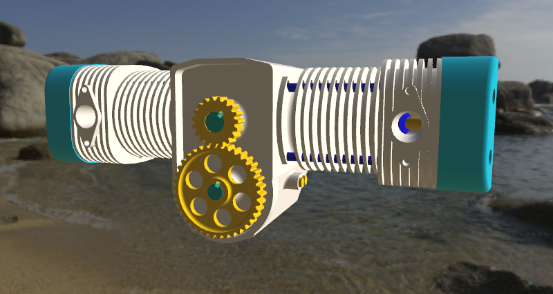</td>
    <td>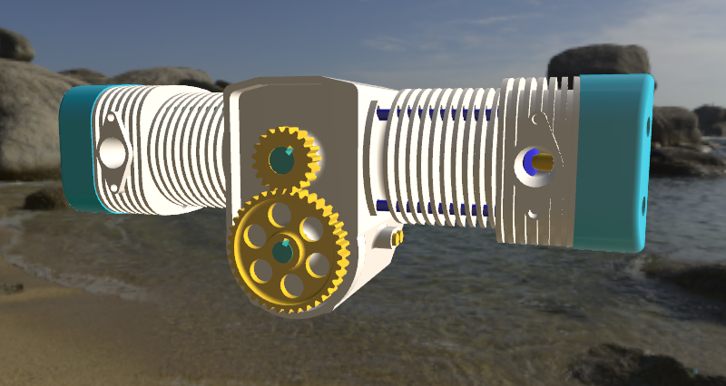</td>
  </tr>
  <tr>
    <td>ABeautifulGame</td>
    <td>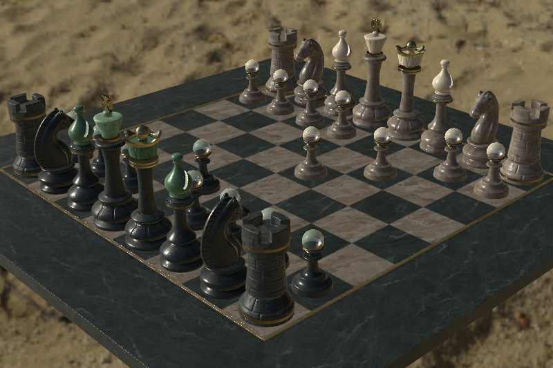</td>
    <td></td>
  </tr>
  <tr>
    <td>DamagedHelmet</td>
    <td></td>
    <td></td>
  </tr>
  <tr>
    <td>IridescenceLamp</td>
    <td></td>
    <td></td>
  </tr>
  <tr>
    <td>IridescentDishWithOlives</td>
    <td></td>
    <td></td>
  </tr>
  <tr>
    <td>MosquitoInAmber</td>
    <td></td>
    <td></td>
  </tr>
  <tr>
    <td>SheenCloth</td>
    <td></td>
    <td></td>
  </tr>
  <tr>
    <td>StainedGlassLamp</td>
    <td></td>
    <td></td>
  </tr>
  <tr>
    <td>ToyCar</td>
    <td></td>
    <td></td>
  </tr>
</table>

Feature Tests

<table>
  <tr>
    <th>Name</th>
    <th>USD+UsdPreviewSurface</th>
    <th>USD+MaterialX</th>
  </tr>
  <tr>
    <td>AlphaBlendModeTest</td>
    <td></td>
    <td></td>
  </tr>
  <tr>
    <td>AttenuationTest</td>
    <td></td>
    <td></td>
  </tr>
  <tr>
    <td>ClearCoatTest</td>
    <td></td>
    <td></td>
  </tr>
  <tr>
    <td>EmissiveStrengthTest</td>
    <td></td>
    <td></td>
  </tr>
  <tr>
    <td>EnvironmentTest</td>
    <td></td>
    <td></td>
  </tr>
  <tr>
    <td>IridescenceDielectricSpheres</td>
    <td></td>
    <td></td>
  </tr>
  <tr>
    <td>IridescenceMetallicSpheres</td>
    <td></td>
    <td></td>
  </tr>
  <tr>
    <td>LightsPunctualLamp</td>
    <td></td>
    <td></td>
  </tr>
  <tr>
    <td>MetalRoughSpheres</td>
    <td></td>
    <td></td>
  </tr>
  <tr>
    <td>MetalRoughSpheresNoTextures</td>
    <td></td>
    <td></td>
  </tr>
  <tr>
    <td>MultiUVTest</td>
    <td></td>
    <td></td>
  </tr>
  <tr>
    <td>NormalTangentMirrorTest</td>
    <td></td>
    <td></td>
  </tr>
  <tr>
    <td>NormalTangentTest</td>
    <td></td>
    <td></td>
  </tr>
  <tr>
    <td>OrientationTest</td>
    <td></td>
    <td></td>
  </tr>
  <tr>
    <td>SpecularTest</td>
    <td></td>
    <td></td>
  </tr>
  <tr>
    <td>TextureCoordinateTest</td>
    <td></td>
    <td></td>
  </tr>
  <tr>
    <td>TextureEncodingTest</td>
    <td></td>
    <td></td>
  </tr>
  <tr>
    <td>TextureSettingsTest</td>
    <td></td>
    <td></td>
  </tr>
  <tr>
    <td>TextureTransformTest</td>
    <td></td>
    <td></td>
  </tr>
  <tr>
    <td>TextureTransformMultiTest</td>
    <td></td>
    <td></td>
  </tr>
  <tr>
    <td>TransmissionRoughnessTest</td>
    <td></td>
    <td></td>
  </tr>
  <tr>
    <td>TransmissionTest</td>
    <td></td>
    <td></td>
  </tr>
  <tr>
    <td>UnlitTest</td>
    <td></td>
    <td></td>
  </tr>
  <tr>
    <td>VertexColorTest</td>
    <td></td>
    <td></td>
  </tr>
</table>

### Third-party glTF models

<table>
  <tr>
    <th>Name</th>
    <th>USD+UsdPreviewSurface</th>
    <th>USD+MaterialX</th>
  </tr>
  <tr>
    <td>Camera_01</td>
    <td></td>
    <td></td>
  </tr>
  <tr>
    <td>CoffeeCart_01</td>
    <td></td>
    <td></td>
  </tr>
  <tr>
    <td>Fangyi</td>
    <td></td>
    <td></td>
  </tr>
  <tr>
    <td>Loewe_von_Asparn</td>
    <td></td>
    <td></td>
  </tr>
  <tr>
    <td>Perseverance</td>
    <td></td>
    <td></td>
  </tr>
  <tr>
    <td>Space_Shuttle</td>
    <td></td>
    <td></td>
  </tr>
</table>

### Custom Tests

<table>
  <tr>
    <th colspan=3>MaterialVariants</th>
  </tr>
  <tr>
    <th>Variant</th>
    <th>UsdPreviewSurface</th>
    <th>MaterialX</th>
  </tr>
  <tr>
    <td>Midnight (0, default)</td>
    <td></td>
    <td></td>
  </tr>
  <tr>
    <td>Beach (1)</td>
    <td></td>
    <td></td>
  </tr>
</table>

## Discussion

Minor observations:
* **Brightness differences**  
Between the UsdPreviewSurface and glTF PBR shading models, the specular response is most likely the cause (see MetalRoughSpheresNoTextures).
* **Missing transmission color attenuation**  
For instance, in the TransmissionTest sample model. This seems to be a current limitation of HdStorm's MaterialX integration.
* **TextureSettingsTest seems to fail**  
It's actually working, but backface culling is disabled by default.

Failures:
* **Material\_04 looks more specular than it should**  
This hints at an actual issue in either 1) guc's handling of normal maps, 2) the MaterialX glTF PBR implementation, 3) MaterialXGenGlsl or 4) HdStorm.
* **ToyCar model cloth is too bright and has shading artifacts**  
The artifacts exist in MaterialXView too, suggesting an issue with the GLSL sheen implementation, or the MaterialX glTF PBR.
